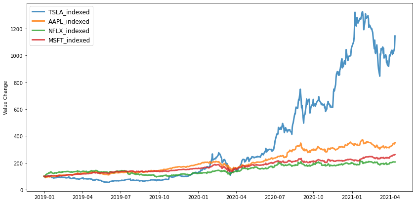

# indexing financial time series (pandas)

This example uses data pulled from yahoo finance. If you have a dataframe from elsewhere, go to part 2.

**Part 1 (Pulling data)**

For this, make sure the yfinance package is installed. 
```python
#pip install yfinance

import pandas as pd
import numpy as np
import yfinance as yf
import matplotlib.pyplot as plt
import datetime as dt
```

Insert the yahoo finance tickers into the variable 'tickers'. You can choose as many as you like.
```python
tickers =['TSLA','AAPL','NFLX','MSFT']
```
Choose timeframe.
```python
start=dt.datetime(2019,1,1)
end= dt.datetime.now()

#pull 'Adj Close' Column and create new dataframe 
assets=yf.download(tickers,start,end)['Adj Close']
assets.head()
```

    


<table border="1" class="dataframe">
  <thead>
    <tr style="text-align: right;">
      <th></th>
      <th>AAPL</th>
      <th>MSFT</th>
      <th>NFLX</th>
      <th>TSLA</th>
    </tr>
    <tr>
      <th>Date</th>
      <th></th>
      <th></th>
      <th></th>
      <th></th>
    </tr>
  </thead>
  <tbody>
    <tr>
      <th>2018-12-31</th>
      <td>38.461140</td>
      <td>98.813278</td>
      <td>267.660004</td>
      <td>66.559998</td>
    </tr>
    <tr>
      <th>2019-01-02</th>
      <td>38.505024</td>
      <td>98.375481</td>
      <td>267.660004</td>
      <td>62.023998</td>
    </tr>
    <tr>
      <th>2019-01-03</th>
      <td>34.669640</td>
      <td>94.756454</td>
      <td>271.200012</td>
      <td>60.071999</td>
    </tr>
    <tr>
      <th>2019-01-04</th>
      <td>36.149662</td>
      <td>99.163513</td>
      <td>297.570007</td>
      <td>63.537998</td>
    </tr>
    <tr>
      <th>2019-01-07</th>
      <td>36.069202</td>
      <td>99.289970</td>
      <td>315.339996</td>
      <td>66.991997</td>
    </tr>
  </tbody>
</table>
</div>


**Part 2 (Indexing)**

To graph a comparable price development graph the assets data frame needs to be indexed. New columns are added for this purpose.
First the indexing row is determined. In this case the initial prices.
```python
assets_indexrow=assets[:1]
assets_indexrow
```


<table border="1" class="dataframe">
  <thead>
    <tr style="text-align: right;">
      <th></th>
      <th>AAPL</th>
      <th>MSFT</th>
      <th>NFLX</th>
      <th>TSLA</th>
    </tr>
    <tr>
      <th>Date</th>
      <th></th>
      <th></th>
      <th></th>
      <th></th>
    </tr>
  </thead>
  <tbody>
    <tr>
      <th>2018-12-31</th>
      <td>38.46114</td>
      <td>98.813278</td>
      <td>267.660004</td>
      <td>66.559998</td>
    </tr>
  </tbody>
</table>
</div>


insert your desired indexing value below. In this case, it is 100.
```python
#creating indexed price columns
for ticker in tickers:
    assets[ticker+'_indexed']=(assets[ticker]/ assets_indexrow[ticker][0])*100 

#dropping initial columns from dataframe
assets.drop(columns =tickers, inplace=True)
```


```python
assets.head()
```


<table border="1" class="dataframe">
  <thead>
    <tr style="text-align: right;">
      <th></th>
      <th>TSLA_indexed</th>
      <th>AAPL_indexed</th>
      <th>NFLX_indexed</th>
      <th>MSFT_indexed</th>
    </tr>
    <tr>
      <th>Date</th>
      <th></th>
      <th></th>
      <th></th>
      <th></th>
    </tr>
  </thead>
  <tbody>
    <tr>
      <th>2018-12-31</th>
      <td>100.000000</td>
      <td>100.000000</td>
      <td>100.000000</td>
      <td>100.000000</td>
    </tr>
    <tr>
      <th>2019-01-02</th>
      <td>93.185097</td>
      <td>100.114100</td>
      <td>100.000000</td>
      <td>99.556945</td>
    </tr>
    <tr>
      <th>2019-01-03</th>
      <td>90.252405</td>
      <td>90.141998</td>
      <td>101.322577</td>
      <td>95.894455</td>
    </tr>
    <tr>
      <th>2019-01-04</th>
      <td>95.459736</td>
      <td>93.990096</td>
      <td>111.174626</td>
      <td>100.354441</td>
    </tr>
    <tr>
      <th>2019-01-07</th>
      <td>100.649037</td>
      <td>93.780899</td>
      <td>117.813641</td>
      <td>100.482417</td>
    </tr>
  </tbody>
</table>
</div>


```python
#indexed returns of assets
plt.figure(figsize=(14, 7))
for c in assets.columns.values:
    plt.plot(assets.index, assets[c], lw=3, alpha=0.8,label=c)
plt.legend(loc='upper left', fontsize=12)
plt.ylabel('Value Change')
```


 


    

    


```python

```

